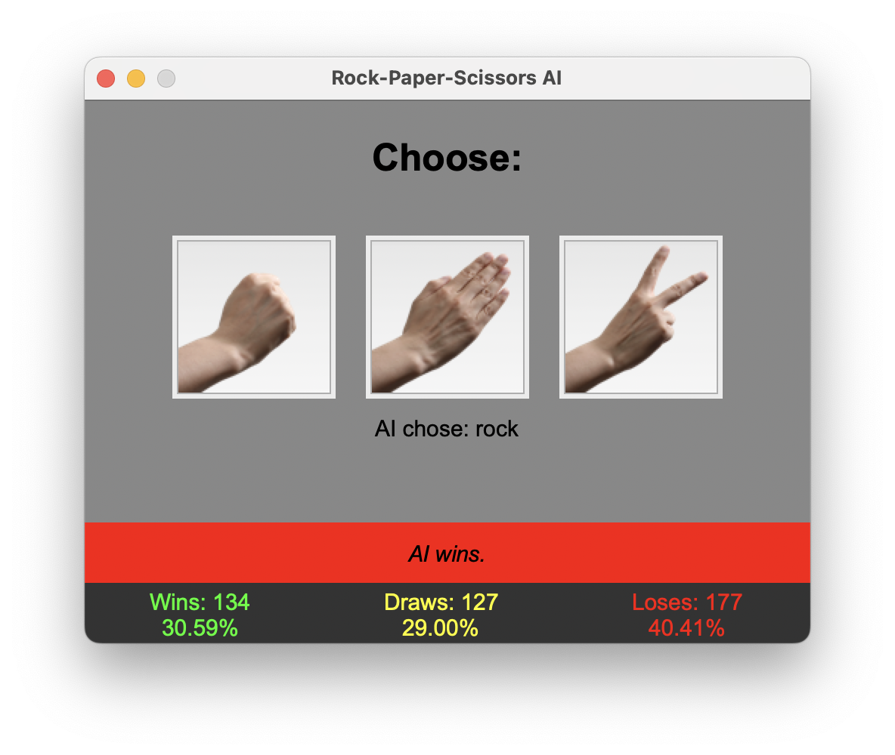

<pre align="center"><b>AI that learns your <i>rock, paper, scissors</i> play style</b></pre>


<br>

 

---

<br>

This app uses simple **pattern recognition**.

Due to the algorithm's complexity being approximately $O(n^3)$, the app doesn't search the entire game history for patterns.

The exact numbers are located in the [data.json](data.json) file.

_Example file:_

```json
{
    "memory": 500,
    "pattern": 100
}
```

- `memory` is the number of last moves the app searches through.
- `pattern` is the length of the longest pattern that will be searched for.
